XIV World Status History
========================

I got bored and decided to write a tool which can visualize the 
congestion history of worlds in FFXIV. See [the Lodestone](https://na.finalfantasyxiv.com/lodestone/playguide/option_service/world_transfer_service/population_balancing/)
for details on how the population balancing incentives work.

## Results 

_Last Updated: 2026-06-02_

These plots show recent history for each Data Center. If you want plots of
all-time history, see [this page](./README_alltime.md).

Note: "Preferred+" was known as "New" before Patch 7.3.

### North American Data Center

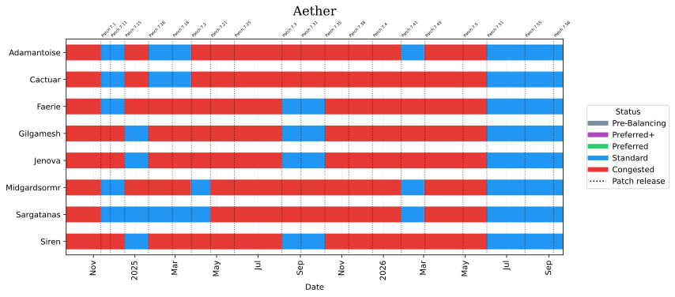
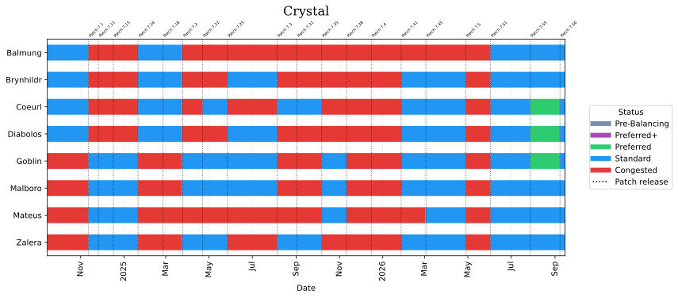
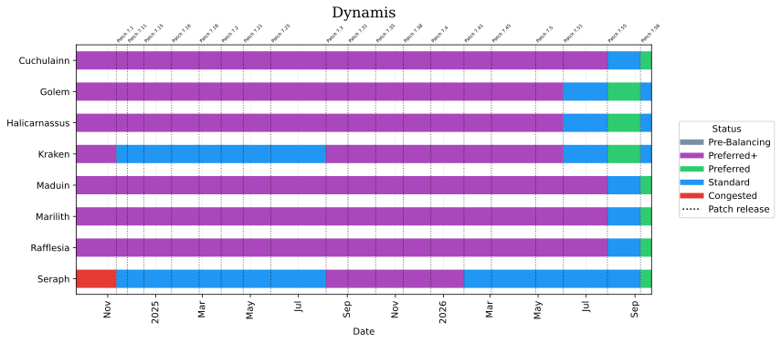
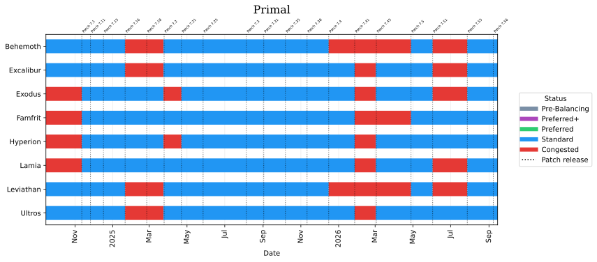

### European Data Center
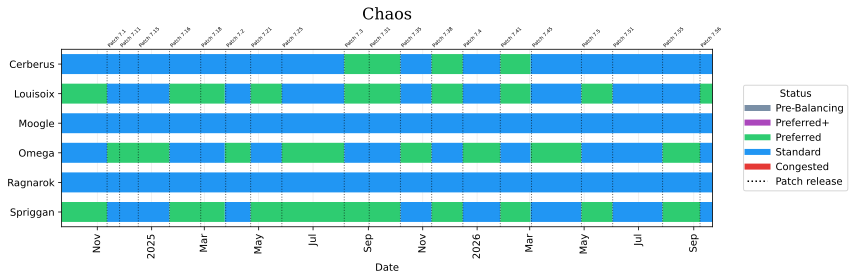
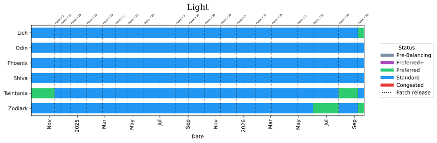

### Japanese Data Center
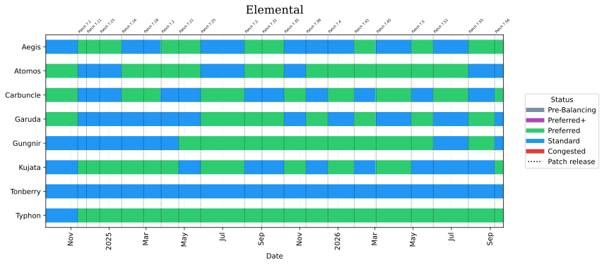
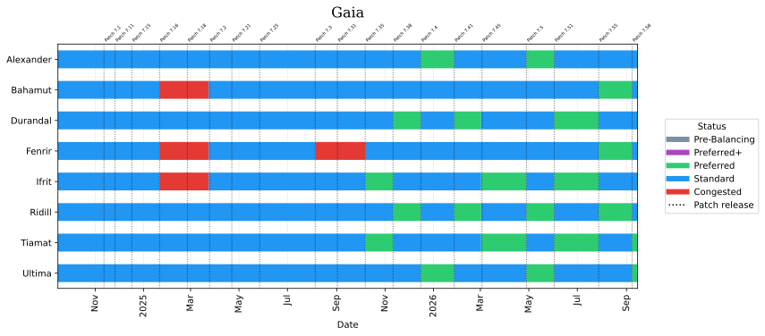
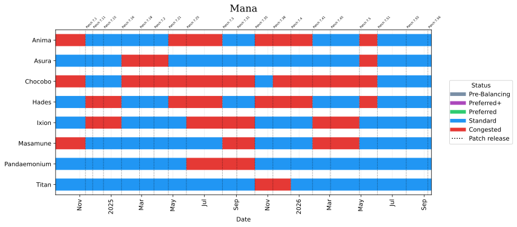
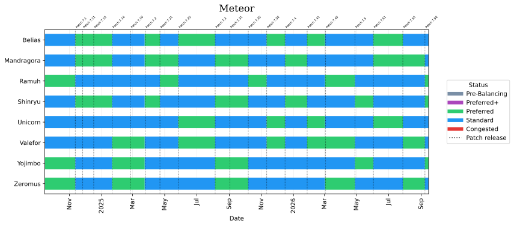
 
### Oceania Data Center
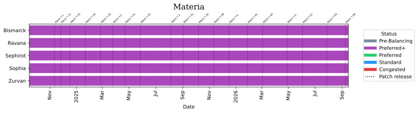

## Technical Details

If you would like a technical README, including instructions on how to
run this code yourself, see [this file](./README_technical.md).

A number of pieces of this repository are written by GPT/Claude, simply
because I don't find trying to write giant globs of regex to try to find
a capture group to be that interesting.
