XIV World Status History
========================

I got bored and decided to write a tool which can visualize the 
congestion history of worlds in FFXIV with regards to the 
World Population Balancing Incentive system (referred to from now
on as the WPBI or the congestion system). The WPBI is the system
which designates certain worlds as "Congested", meaning that 
no new characters can be created there, as well as "New" or
"Preferred", which give bonuses to character creation and transfers
to those worlds. See [the Lodestone](https://na.finalfantasyxiv.com/lodestone/playguide/option_service/world_transfer_service/population_balancing/)
for details on how this system works.

## Results (as of 2025-10-14)

### North American Data Center

Note: "PRE_WBPI" is a placeholder status for before the congestion system was
implemented. Presumably, all worlds that were not labeled "Congested" when the
system was introduced became "Standard" worlds, but I didn't want to make
assumptions so I don't change a world's status away from "PRE_WBPI" until
a notice comes out confirming a status change.

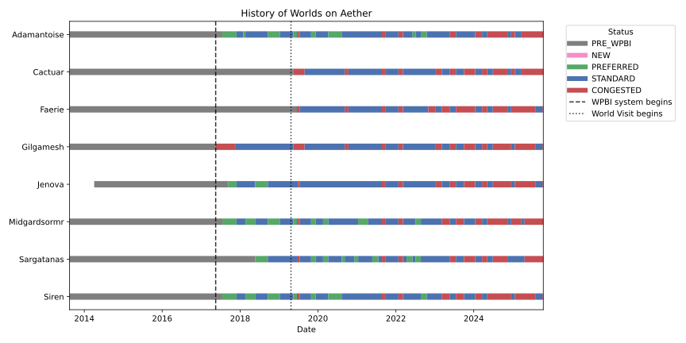
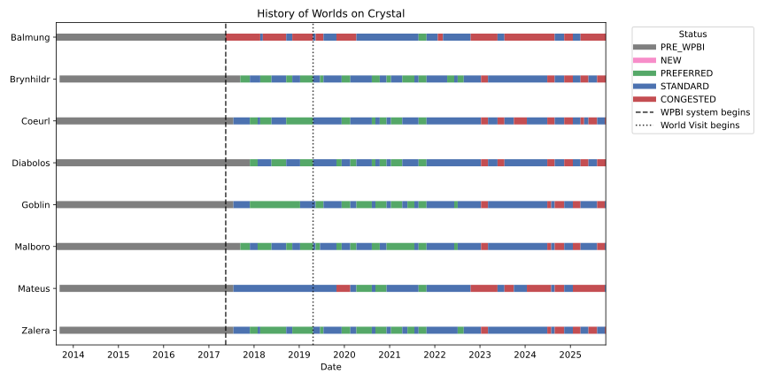
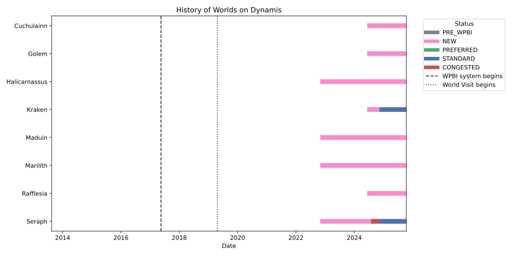
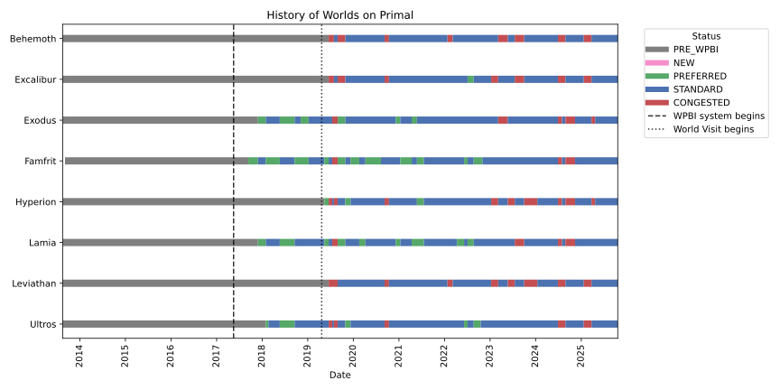

### European Data Center
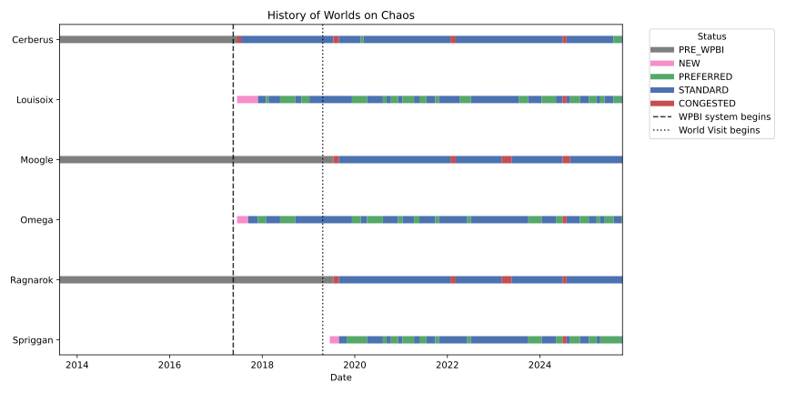
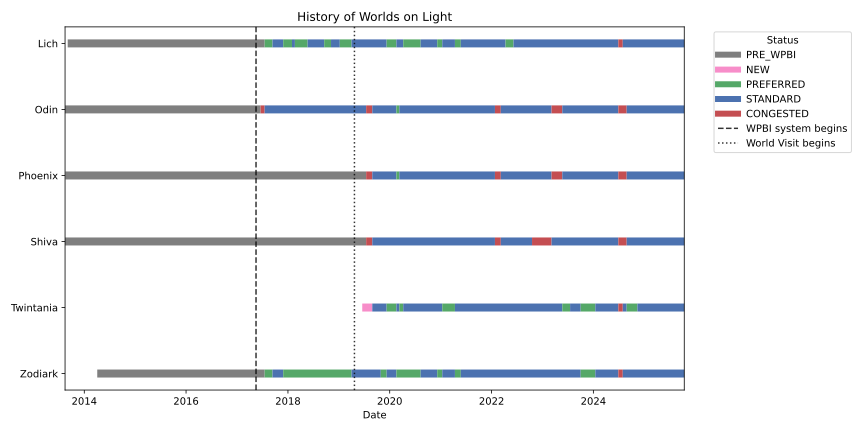

### Japanese Data Center
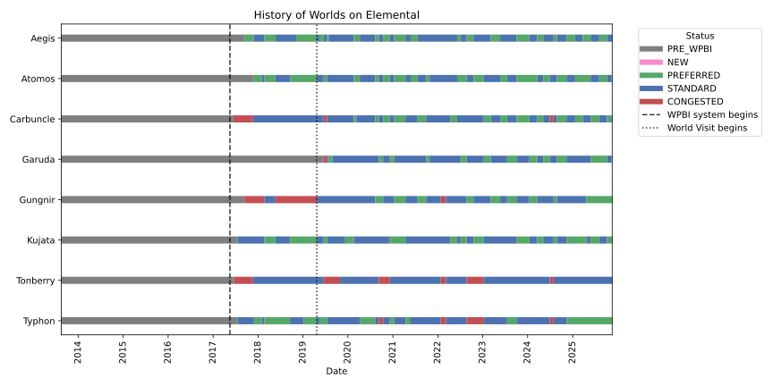
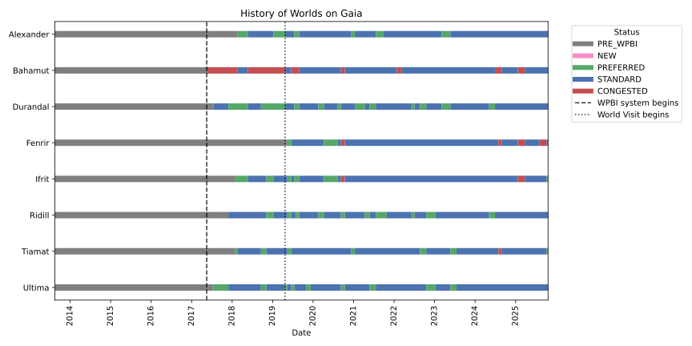
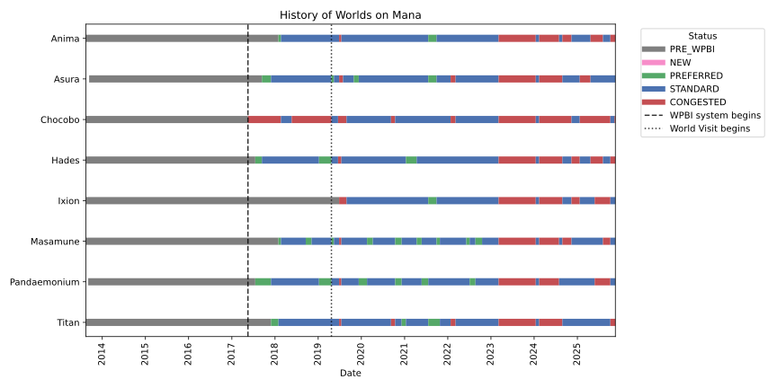
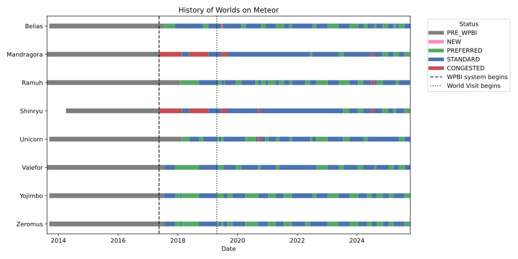
 
### Oceania Data Center
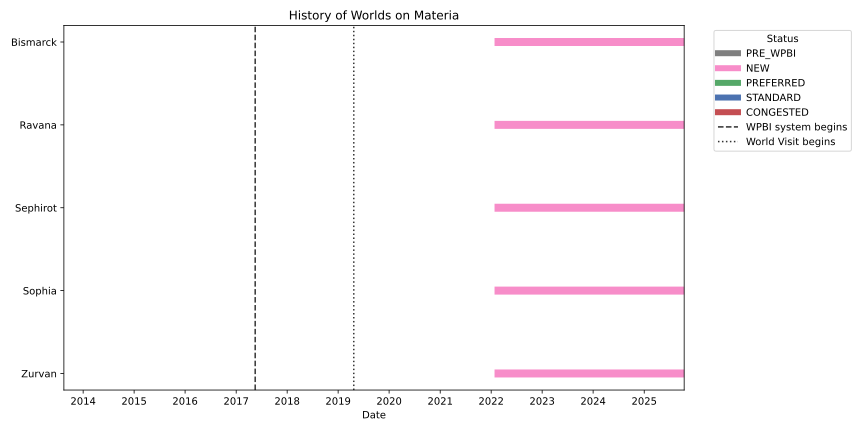


## More details on tooling

This tool consists of several components: 

- a scraper to gather data from Lodestone (mostly written by ChatGPT because I *hate* writing scraper code)
- a cleanup utility which grabs just the world status changes,
- some code to analyze and validate the world status history and serialize it
- plotting code to visualize the changes (also mostly written by GPT, because I haven't touched matplotlib in a hot decade)

**This code is just something I threw together in an evening and is not
intended to be very user-friendly**. You will need to be at least somewhat
familiar with Python (or be willing to ask a friend/LLM for help) in order
to be able to use this code effectively.

### Quickstart

```bash
   python -m venv xivhist
   # Activation command may depend on your shell
   source xivhist/bin/activate
   pip install -r requirements.txt

   # I don't know what happens if you give the wrong max_pages here. I suggest
   # visiting the lodestone to confirm the page number is correct. Also note
   # that this command will take a while.
   python scrape_notices.py --max_pages 70 --jsonl notices.jsonl

   # Reads notices.jsonl to create filtered.jsonl
   python filter_notices.py

   # Reads filtered.jsonl to create worlds.pkl
   python analyze_world_history.py

   # Uses data in worlds.pkl to plot
   python plot_world_history.py
```

### Data Sources

Most data for world congestion status is found in the form of notices on the
Lodestone. However, in the early days of the system, it seems that congested
worlds were announced via other means. I have manually collected the data from
some of these notices into the script, but I may have missed some, meaning the
data for the first two months after the introduction of the WPBI system may not
be accurate. The first standard notice happens on 2017-07-18.

In addition, the dates for creation of a world are taken from the 
[Console Games Wiki](https://ffxiv.consolegameswiki.com/wiki/Servers) and
stored in `world_creation.txt`. Any world which is created before the
congestion system is implemented is given an initial state of `PRE_WPBI` which
just means that it doesn't have a congested status yet. Any world created
after the system is assumed to start off in the `NEW` state.

Note: "New" has been renamed to "Preferred+" in 7.3, about a month
before I wrote this, so the scraper will probably need to be updated
at some point.

### Scraper Checking

Scraping datasets like this can be surprisingly difficult. For example, 
an initial version of the code checked for the line "Changed to Congested
World" to determine which worlds were being set to Congested. However, this
can actually fail for two different reasons:

- [Several notices have a typo where the line is "Changde to Congested World"](https://na.finalfantasyxiv.com/lodestone/news/detail/d6342fa250d71b1d9694824ea1796cd1094b1431)
- [If only one world is changed, the notice may read "Changed to **a** Congested World"](https://na.finalfantasyxiv.com/lodestone/news/detail/6c7d04c3238cede50b04abc4787fe0123aaf6f82)

This potentially creates a lot of issues where transitions between different 
world states can be missed. To try to address this, I wrote a sanity check
which goes over the final list of changes and checks to make sure that
a world never transitions to the same state (e.g. if a world was Standard,
and then we see a notice that it has been changed to a Standard world, this
indicates that we probably missed a change to congested somewhere) and that
there are no changes that occur on the same day.

This sanity check was instrumental to finding the above two issues. However,
it is a test, and definitionally tests cannot prove the absence of bugs, so
you should be a little wary of this data still.

### Plotting Options

The default functionality of the plotting script is to write one SVG per DC
to the `plots` directory. Additional arguments include limiting the x-axis
to a certain set of dates, changing the worlds plotted (pass `worlds=None`
to plot all worlds on the same plot), and changing the output file name.
